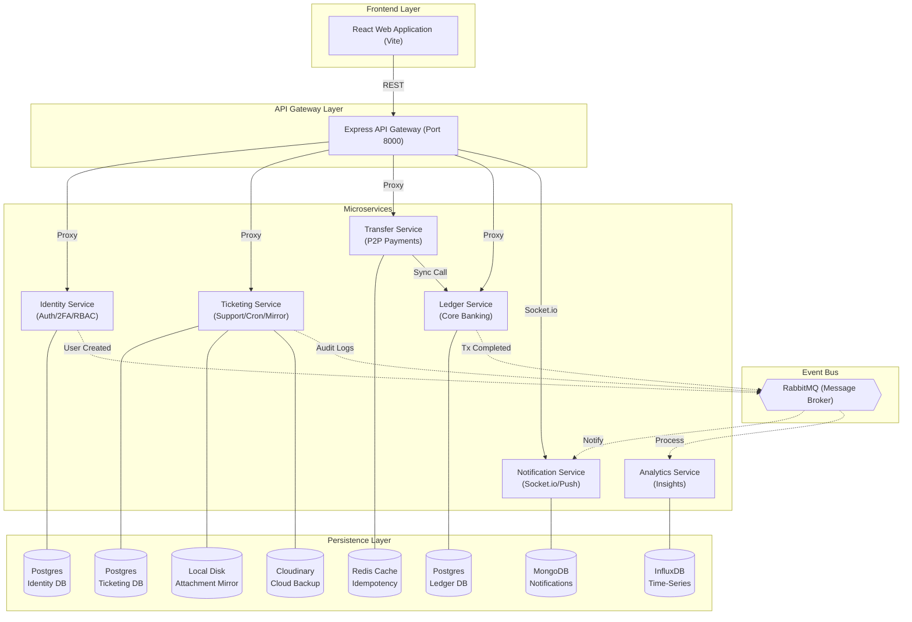

# Zenith Banking - Architecture Diagram (Mermaid)

Copy the following block into a Notion "Code" block (set to Mermaid) to render the diagram.

```mermaid
graph TD
    subgraph "Frontend Layer"
        UI["React Web Application (Vite)"]
    end

    subgraph "API Gateway Layer"
        GW["Express API Gateway (Port 8000)"]
    end

    subgraph "Event Bus"
        RMQ{{"RabbitMQ (Message Broker)"}}
    end

    subgraph "Microservices"
        ID["Identity Service<br/>(Auth/2FA/RBAC)"]
        TC["Ticketing Service<br/>(Support/Cron/Mirror)"]
        LD["Ledger Service<br/>(Core Banking)"]
        TR["Transfer Service<br/>(P2P Payments)"]
        NT["Notification Service<br/>(Socket.io/Push)"]
        AN["Analytics Service<br/>(Insights)"]
    end

    subgraph "Persistence Layer"
        DB_ID[("Postgres<br/>Identity DB")]
        DB_TC[("Postgres<br/>Ticketing DB")]
        DB_LD[("Postgres<br/>Ledger DB")]
        REDIS[("Redis Cache<br/>Idempotency")]
        DB_NT[("MongoDB<br/>Notifications")]
        DB_AN[("InfluxDB<br/>Time-Series")]
        LOCAL[("Local Disk<br/>Attachment Mirror")]
        CLOUD[("Cloudinary<br/>Cloud Backup")]
    end

    %% Routing
    UI -->|REST| GW
    GW -->|Proxy| ID
    GW -->|Proxy| TC
    GW -->|Proxy| TR
    GW -->|Proxy| LD
    GW -->|Socket.io| NT

    %% ID Logic
    ID --- DB_ID

    %% TC Logic
    TC --- DB_TC
    TC --- LOCAL
    TC --- CLOUD

    %% Financial Logic
    TR --- REDIS
    TR -->|Sync Call| LD
    LD --- DB_LD

    %% Data Processing
    NT --- DB_NT
    AN --- DB_AN

    %% Event Bus Connections
    ID -.->|User Created| RMQ
    LD -.->|Tx Completed| RMQ
    TC -.->|Audit Logs| RMQ
    RMQ -.->|Notify| NT
    RMQ -.->|Process| AN
```
